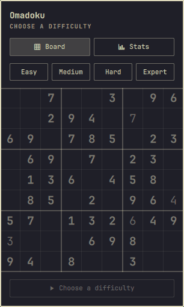

# Omadoku

Sudoku in the Omarchy bar. Click the icon, get a board; the clock keeps running
while the popup is closed, and the game survives a shell restart.

An [Omarchy](https://omarchy.org/) shell plugin (`bar-widget`), running inside
the long-lived `omarchy-shell` Quickshell process.

```
[ menu | workspaces ]   [ clock ]   [ │O│M│A│D│O│K│U│ 4:12 | audio | power ]
                                       └─ click for the board
```

<p align="center"></p>

## Requirements

| Needs           | Why                                                                                                                     |
| --------------- | ----------------------------------------------------------------------------------------------------------------------- |
| Omarchy 4.x     | Uses the `omarchy-shell` plugin API (`schemaVersion: 1`)                                                                |
| Quickshell 0.3+ | The shell Omadoku's QML runs inside; installed by Omarchy                                                               |
| A Nerd Font     | The bar falls back to a grid glyph on vertical bars, and the panel buttons use Material Design icons. Omarchy ships one |

**External dependencies: none.** No libraries are vendored or downloaded, no
package needs installing, and nothing is fetched at runtime. Omadoku makes no
network requests of any kind. The only external command it ever runs is
`mkdir -p` to create its own state directory.

## Install

```bash
omarchy plugin add https://github.com/bhaveshsooka/omadoku.git --enable
```

That clones, validates, and enables in one go. It asks twice before doing
anything: once to confirm the clone — plugins run unsandboxed inside
`omarchy-shell`, so read the code first — and once to pick which bar section to
put it in, defaulting to the right. Add `--yes` to skip both and take the
defaults, which is the path for scripts.

## Update

```bash
omarchy plugin update io.github.bhaveshsooka.omadoku   # fast-forward, shows a diff first
```

## Remove

```bash
omarchy plugin remove io.github.bhaveshsooka.omadoku   # disable, unlink, rescan
rm -rf ~/.local/state/omadoku                          # the save and stats
```

`remove` disables the plugin — which takes the widget out of your bar layout —
deletes the plugin directory, and rescans. The save and stats are the only thing
Omadoku leaves behind, and the `rm` above is all it takes to clear them. Nothing
else on your system is touched.

## What Omadoku writes

It owns two files, both under `XDG_STATE_HOME`, both created on first run:

| Path                                | Contents                        |
| ----------------------------------- | ------------------------------- |
| `~/.local/state/omadoku/game.json`  | The game in progress            |
| `~/.local/state/omadoku/stats.json` | Lifetime solve counts and times |

**It never writes your configuration.** `~/.config/omarchy/shell.json` changes
only when _you_ run `omarchy plugin enable/disable`, `omarchy bar move`, or edit
the plugin's settings — all of which are Omarchy's own commands acting on your
instruction, not something the plugin does on its own. Omadoku writes nothing
outside its own state directory, touches no other application's config, and
requires no elevated privileges.

## Starting a game

With no game in progress the panel is not blank — a demo board solves itself
behind the difficulty buttons, and the widget waits. Picking a difficulty only
_arms_ it; **Start** deals the board, and stays disabled until something is
armed. Nothing is ever dealt on your behalf.

The same rule holds mid-game: clicking a difficulty changes what **New** will
deal, it does not deal it. So a stray click on Expert can never cost you the
board you are on.

Opening the panel always returns you to the game in progress, and never deals a
new one. It lands on the Board tab even if you left it showing Stats.

## Playing

**Mouse** — left click the bar icon opens the board, right click pauses, middle
click does nothing. Dealing a board is only ever done from the panel, where the
confirmation prompt is visible. In the grid, click a cell to select it and right
click to clear it.

**Keyboard**, once the popup has focus:

| Key                                  | Does                                                   |
| ------------------------------------ | ------------------------------------------------------ |
| `1`–`4`                              | _With no game:_ arm Easy / Medium / Hard / Expert      |
| `Enter`                              | _With no game:_ start the armed board                  |
| `1`–`9`                              | Place the digit, or pencil it in when notes mode is on |
| `0`, `.`, `Backspace`, `Delete`, `x` | Clear the cell                                         |
| Arrows or `hjkl`                     | Move the cursor (it wraps at the edges)                |
| `Space` or `n`                       | Toggle pencil marks                                    |
| `a`                                  | Fill every empty cell with all its legal candidates    |
| `u` / `r`                            | Undo / redo                                            |
| `?`                                  | Reveal one cell                                        |
| `p`                                  | Pause the clock                                        |
| `c`                                  | Clear your entries, keep the puzzle                    |
| `g`                                  | New game at the armed difficulty                       |
| `s` / `b`                            | Switch to the Stats / Board tab                        |
| `Esc`                                | Back out of a prompt, then the Stats tab, then close   |

On a confirmation prompt, `y` or `Enter` confirms and `n` or `Esc` cancels.

A finished board stops taking input: undo, redo, clear and the pencil mark
toggle are all disabled, and Abandon gives way to **Done**. Deal a new board, or
press Done to go back to the start screen. See [Winning](#winning).

Typing the digit that is already in a cell clears it, which is what every other
sudoku does.

Clues are bold; your own entries are lighter, so the two stay distinguishable
in themes where the accent colour equals the foreground. A digit that repeats in
its row, column, or box turns the theme's urgent colour — turn that off in the
settings for a stricter game.

## Winning

Fill the last cell and the board takes itself apart: every digit bursts into
confetti in a random order, the grid empties, and a message lands on the bare
board with the difficulty and your time. It holds for five seconds, then the
finished board comes back. Any key or a click cuts it short — the key still does
whatever you pressed it for.

Solve with the popup closed and the parade waits until you next open it, rather
than playing to an empty room. A game restored from disk that was already
finished does not replay it.

In the bar, a solved board fills the wordmark's cells and brightens its edge.
That is a fill rather than a colour change on purpose: the shell palette has an
urgent colour and no success one, and in some themes the accent colour is the
same value as the foreground, so a recoloured win would be no visible win at
all.

## Stopping, clearing, abandoning

**Pause** stops the clock and drops a curtain over the grid — it hides the board
rather than dimming it, so you cannot keep solving by eye. Pause from the `p`
key, the Pause button, a right click on the bar icon, or IPC. Set
`pauseWhenClosed` to pause automatically whenever the board is off screen. A
curtained board takes no input, so Hint and the pencil mark toggle are disabled
until you resume.

Four ways to take a board off the table, in increasing order of loss:

| Action          | Keeps                    | Loses                                     | Undoable        |
| --------------- | ------------------------ | ----------------------------------------- | --------------- |
| **Done**        | nothing                  | nothing — the board was already finished  | n/a             |
| **Clear** (`c`) | the puzzle and the clock | your entries and pencil marks             | yes — press `u` |
| **New** (`g`)   | nothing of this board    | the board; breaks the streak              | no              |
| **Abandon**     | nothing                  | the board and its time; breaks the streak | no              |

Clear is undoable, so it just does it. New and Abandon ask first — but only when
there is something to lose: dealing over an untouched board skips the prompt.
The question is always asked in the panel, where you can see it — which is why
neither can be triggered from the bar icon.

Clear and Abandon apply to a game in progress, so both are disabled once a board
is solved — there is nothing left to clear and nothing left to give up on. On a
finished board the Abandon button becomes **Done**, which puts the board away
and returns you to the start screen. It acts immediately: nothing is at stake,
the solve was already counted, and unlike Abandon it costs no streak.

Abandon and Done both return to the idle state — no board, no clock, the bar
icon back to "click to start", the demo board solving itself behind the
difficulty buttons again, and the difficulty selection cleared, so the widget is
asking the question again rather than holding a stale answer. They differ only
in what they cost: Abandon records a given-up game and breaks the streak, Done
records nothing.

## Stats

The **Stats** tab (`s`) keeps a lifetime record in
`~/.local/state/omadoku/stats.json`:

- solves, win rate, and current streak across the top
- solves, best time, and average time per difficulty
- games played, solves without hints, best streak, hints used, and total time on
  solved games

A streak is consecutive solves; abandoning a board, or dealing a new one over a
board you had not finished, resets it to zero. A solve counts once per board
dealt: a finished board cannot be un-finished, since undo and clear are both
disabled on it, so there is no way to score the same deal twice.

Stats are derived entirely from two events the game already knows about — a
board dealt, and a board solved with its time and hint count — so there is no
history file to drift out of sync with the save.

**Reset statistics** at the foot of the tab erases the lot. It asks first, and
cannot be undone. It wipes the lifetime record only — the game you are playing
lives in a separate file and is untouched, so a reset is not a quiet way to lose
your board. To clear both, reset the stats and abandon the game, or remove
`~/.local/state/omadoku` while the shell is stopped.

## Settings

Per-widget settings live in the widget's entry in `~/.config/omarchy/shell.json`
and are editable through Setup > Plugins.

| Key                  | Default    | Meaning                                                                               |
| -------------------- | ---------- | ------------------------------------------------------------------------------------- |
| `difficulty`         | `Medium`   | Difficulty for new games                                                              |
| `showTimer`          | `true`     | Show elapsed time beside the bar icon                                                 |
| `barStyle`           | `Wordmark` | `Wordmark` draws OMADOKU as a row of sudoku cells; `Icon` uses the compact grid glyph |
| `cellSize`           | `34`       | Board cell size in pixels (22–56)                                                     |
| `highlightPeers`     | `true`     | Shade the selected cell's row, column and box                                         |
| `highlightSameDigit` | `true`     | Shade cells holding the same digit                                                    |
| `markConflicts`      | `true`     | Colour repeated digits                                                                |
| `autoCleanNotes`     | `true`     | Placing a digit erases that pencil mark from cells it sees                            |
| `pauseWhenClosed`    | `false`    | Stop the clock whenever the board is off screen                                       |

## IPC

The plugin registers its id as an IPC target, so anything — a Hyprland
keybinding, a script — can drive it:

```bash
omarchy-shell io.github.bhaveshsooka.omadoku toggle
omarchy-shell io.github.bhaveshsooka.omadoku newGame Hard
omarchy-shell io.github.bhaveshsooka.omadoku pause
omarchy-shell io.github.bhaveshsooka.omadoku hint
omarchy-shell io.github.bhaveshsooka.omadoku clear
omarchy-shell io.github.bhaveshsooka.omadoku abandon
omarchy-shell io.github.bhaveshsooka.omadoku status
omarchy-shell io.github.bhaveshsooka.omadoku stats
omarchy-shell io.github.bhaveshsooka.omadoku done
omarchy-shell io.github.bhaveshsooka.omadoku resetStats
```

`newGame` and `abandon` respect the confirmation: with a game in progress they
return `confirm` and open the panel onto the prompt rather than acting. `clear`
is undoable and acts immediately. Calling `newGame` with no argument and nothing
armed opens the panel to ask, rather than failing silently at a bar icon that
has no way to explain itself.

`clear` and `abandon` are disabled on a finished board just as their buttons
are, and say so — `already solved`, or `nothing to clear` on an untouched one —
rather than reporting `ok` for something they did not do.

`done` puts a finished board away and returns to the start screen, the same as
the button; it answers `not solved` on a game still in progress.

`resetStats` never wipes anything on its own: it returns `confirm` and opens the
panel onto the question, so an irreversible action always takes a second,
deliberate press somewhere you can read what it does.

`newGame` takes `Easy`, `Medium`, `Hard`, or `Expert`; an unrecognised name
falls back to the configured difficulty rather than failing, so a keybinding
with a typo still deals a playable game. (It is not called `new` because that is
a reserved word.)

## How it works

Puzzle generation, the difficulty model, persistence, the drawn bar wordmark,
and the attract loop are described in [ARCHITECTURE.md](ARCHITECTURE.md).

## Contributing

[CONTRIBUTING.md](CONTRIBUTING.md) covers the branching model, how to run the
tests and the plugin itself from a checkout, and how a release reaches both
`main` and the marketplace listing.

## Licence and credits

MIT — see [LICENSE](LICENSE). Copyright (c) 2026 Bhavesh Sooka.

Written for this plugin; no third-party code is vendored or bundled, and there
are no external dependencies. The bar-widget and panel scaffolding follows the
pattern established by [OmaWarden](https://github.com/salemsayed/omawarden)
(MIT, © 2026 Salem Sayed), whose `BarWidget.qml` was used as a reference for
Omarchy's plugin-hosting contract.

The bar wordmark and every icon in the panel are either drawn by the plugin's
own QML (`Icon.qml`) or are standard Material Design glyphs supplied by the Nerd
Font already on the system — no icon or image files are redistributed here.

`preview.png` and `preview.gif` are screenshots of this plugin running, captured
from its own interface. They contain no third-party artwork.
